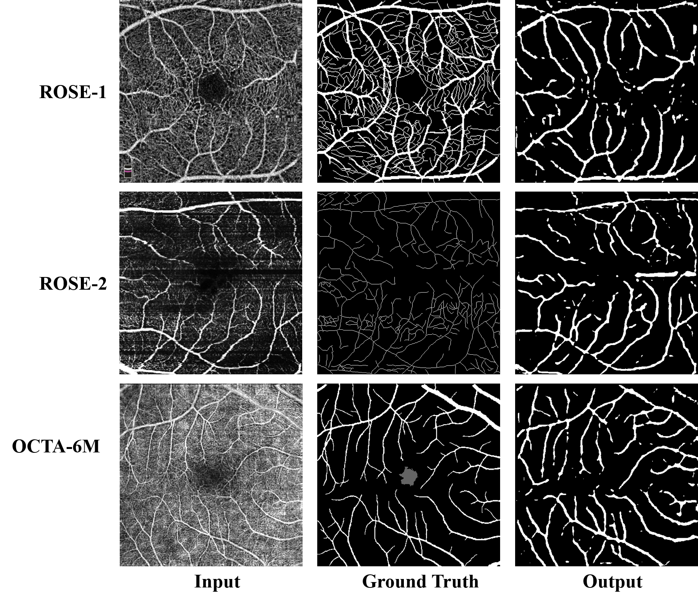
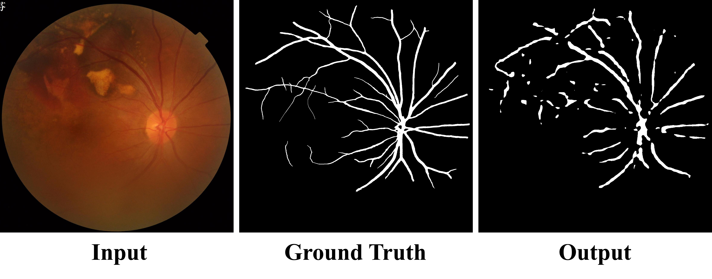
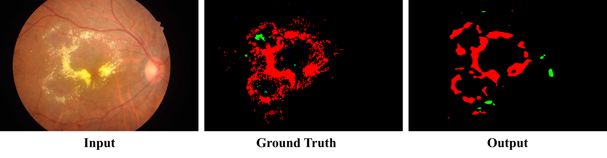
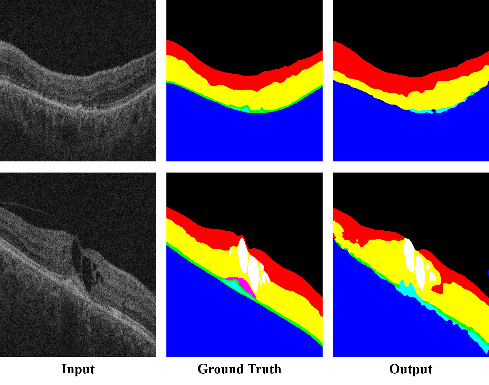

# LearnablePromptSAM
Try to use the SAM-ViT as the backbone to create the visual prompt tuning model for semantic segmentation.


## Some samples for the one-shot learning

+ OCTA Vessel Segmentation (It seems that the thin vessel cannot be recognized.)

  

  <center>Fig.1 Segmentation results of OCTA. We only segment the vessel, and we use one image from the ROSE-1 to train the model.</center>

+ Color Fundus

  + Vessel Segmentation

    

    <center>Fig.2 Segmentation results of fundus. We only segment the vessel, and we use one image from the FIVES to train the model.</center>

  + Lesion Segmentation (It seems that the the model is not suitable for the segmentation of the discrete lesions, may using few-shot learning can resolve it?)

    ​	

    <center>Fig.3 Results for lesion segmentation of the lesion in color fundus. We use one image from the IDRiD dataset to train the model.</center>

+ OCT Layer Segmentation

  + AROI dataset (It seems that we needs to use the few-shot learning to help the model see more settings.)

    

  <center>Fig.4 Results for OCT segmentation. We use one image from the AROI dataset to train the model.</center>

## Usage

+ Clone the code to your PC.

  ```shell
  git clone https://github.com/Qsingle/LearnablePromptSAM.git
  ```

+ Download the weights from original [repository](https://github.com/facebookresearch/segment-anything#model-checkpoints).

+ Fine-tune the model with our code (In our experiments, we found that `lr=0.05`  can get a better results. You can change it.).

  ```shell
  python train_learnable_sam.py --image /path/to/the/image \
                                --mask_path /path/to/the/mask \
                                --model_name vit_h \
                                --checkpoint /path/to/the/pretrained/weights \
                                --save_path /path/to/store/the/weights \
                                --lr 0.05 \
                                --mix_precision \
                                --optimizer sgd
  ```


## 2023.04.13

+ Upload the sample code for the model.
+ Update the README
+ Given the sample for the one-shot learning.


***TODO***

- [ ] Dynamic Head for segmentation.
- [ ] Optimize the training process.
- [ ] Support for the training of few-shot learning.
- [ ] Improving the performance of the model.


## Reference

[Segment-Anything](https://github.com/facebookresearch/segment-anything)

[IDRiD](https://idrid.grand-challenge.org/)

[ROSE](https://imed.nimte.ac.cn/dataofrose.html)

[AROI](https://ipg.fer.hr/ipg/resources/oct_image_database)

[FIVES](https://doi.org/10.6084/m9.figshare.19688169.v1)

