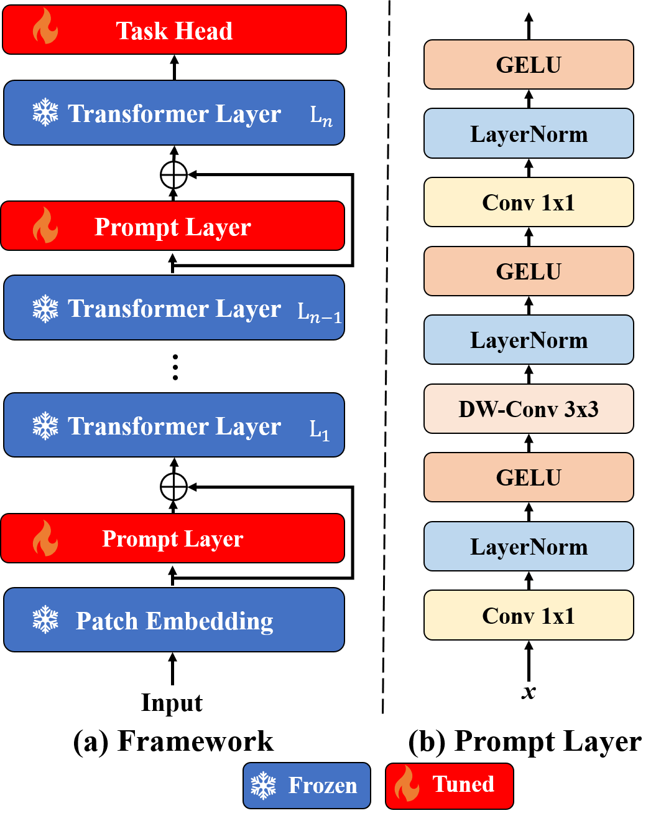

# LearnablePromptSAM
Try to use the SAM-ViT as the backbone to create the visual prompt tuning model for semantic segmentation.  More of the details can be seen at the technical report at [link](https://arxiv.org/abs/2304.13425)


## Motivation

As the original SAM can not be used at the optical images like color fundus and OCT (As the following image shows.), thus we introduce the learnable prompt layer (Adapter) to fine-tune the SAM.


## Structure




## Experiments Results

+ The results of the one-shot learning:

  

+ Results for the zero-shot after tuned.

  

## Usage

+ Clone the code to your PC.

  ```shell
  git clone https://github.com/Qsingle/LearnablePromptSAM.git
  ```

+ Download the weights from original [repository](https://github.com/facebookresearch/segment-anything#model-checkpoints).

+ Fine-tune the model with our code (In our experiments, we found that `lr=0.05`  can get a better results. You can change it.).

  ```shell
  python train_learnable_sam.py --image /path/to/the/image \
                                --mask_path /path/to/the/mask \
                                --model_name vit_h \
                                --checkpoint /path/to/the/pretrained/weights \
                                --save_path /path/to/store/the/weights \
                                --lr 0.05 \
                                --mix_precision \
                                --optimizer sgd
  ```


## 2023.08.15
+ Fix the dtype error in train_learnable_sam.py
+ We merge this reposity to [imed_vision](https://github.com/Qsingle/imed_vision) and add the implementation for the DPT at the new version.


## 2023.04.27 

+ Update README
+ Update code.


## 2023.04.13

+ Upload the sample code for the model.
+ Update the README
+ Given the sample for the one-shot learning.


***TODO***

- [ ] Dynamic Head for segmentation.
- [ ] Optimize the training process.

- [x] Support for the training of few-shot learning.

- [x] Improving the performance of the model.


## Reference

[Segment-Anything](https://github.com/facebookresearch/segment-anything)

[IDRiD](https://idrid.grand-challenge.org/)

[ROSE](https://imed.nimte.ac.cn/dataofrose.html)

[AROI](https://ipg.fer.hr/ipg/resources/oct_image_database)

[FIVES](https://doi.org/10.6084/m9.figshare.19688169.v1)

